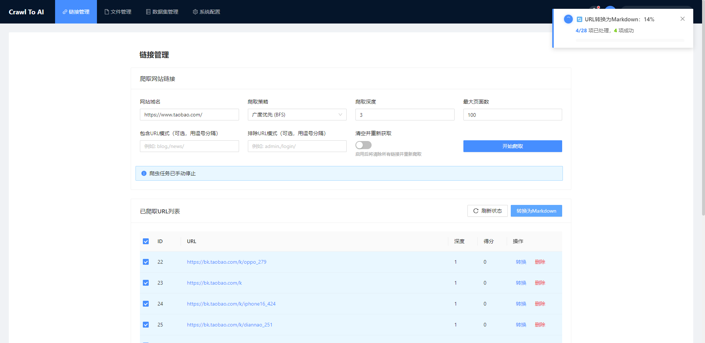
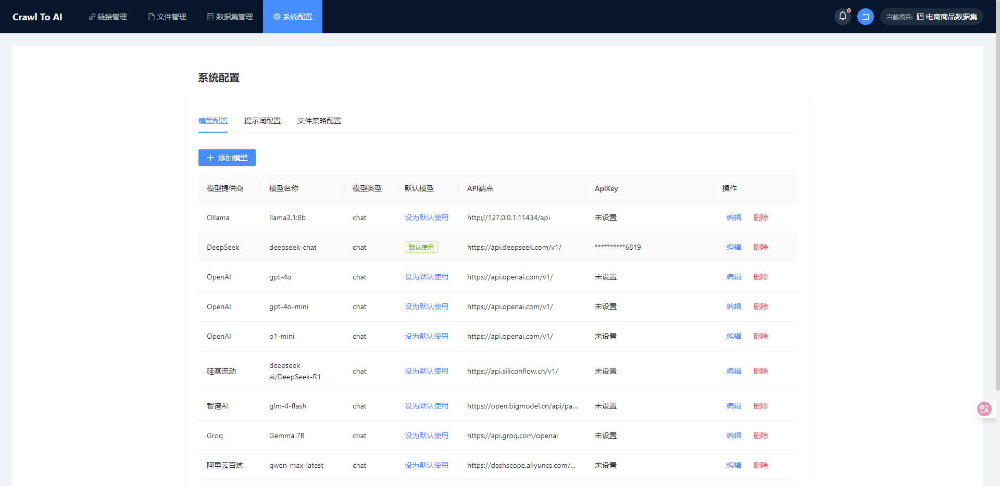

<div align="center">

**A Powerful Large Model Fine-tuning Dataset Generation and Management Tool**

[简体中文](./README.md) | [English](./README.en.md)

</div>

# Dataset Generation and Large Model Fine-tuning Tool

A large model fine-tuning dataset generation and management tool that enables one-click crawling of links from specified domains, supports converting links into large model-friendly Markdown files, and supports converting Markdown files into datasets suitable for training large models through ChatGPT, Deepseek, Gemma, and other large models.

## Features

- Support for deep crawling of all links from specified domains
- Support for converting links into large model-friendly Markdown files
- Support for uploading .md, .txt, .pdf, .docx, .doc and other files, with automatic conversion to .md files
- Support for intelligent algorithm-based segmentation of Markdown files
- Support for converting Markdown files into datasets suitable for training large models through DeepSeek, ChatGPT, Gemma, and other large models
- Support for custom addition, editing, and modification of dataset data
- Support for exporting in JSONL and JSON formats, with Alpaca, ShareGPT, and custom formats
- Support for previewing conversion results

## Feature Screenshots

<table>
  <tr>
    <td align="center" width="33%">
      
      <br><small>Project Management</small>
    </td>
    <td align="center" width="33%">
      
      <br><small>Link Management</small>
    </td>
    <td align="center" width="33%">
      
      <br><small>Md File Conversion</small>
    </td>
  </tr>
  <tr>
    <td align="center" width="33%">
      
      <br><small>File Management</small>
    </td>
    <td align="center" width="33%">
      
      <br><small>File to Dataset Conversion</small>
    </td>
    <td align="center" width="33%">
      
      <br><small>Data Management</small>
    </td>
  </tr>
  <tr>
    <td align="center" width="33%">
      
      <br><small>System Settings</small>
    </td>
    <td align="center" width="33%">
    </td>
    <td align="center" width="33%">
    </td>
  </tr>
</table>

## Quick Start

### Install Dependencies

1. Backend dependencies:

```bash
# Recommended Python version is python=3.10
# Create virtual environment
python -m venv venv
# Activate environment (in PowerShell)
.\venv\Scripts\Activate.ps1
# Install all dependencies from requirements.txt
pip install -r requirements.txt
```

2. Frontend dependencies:

```bash
cd frontend
npm install
```

### Run the Project

1. Start the backend server:

```bash
uvicorn app.main:app --reload --host 0.0.0.0 --port 8000 --ws websockets
```

2. Start the frontend development server:

```bash
cd frontend
npm run dev
```

3. Access in browser: `http://localhost:3000`

## Project Structure

```
├── app/                    # Backend application directory
│   ├── api/                # API interface directory
│   │   ├── crawler.py      # Crawler API
│   │   ├── system.py       # System API
│   │   ├── files.py        # File operations API
│   │   ├── dataset.py      # Dataset API
│   │   └── __init__.py     # Initialization file
│   ├── core/               # Core functionality
│   │   └── config.py       # Configuration file
│   ├── schemas/            # Data schemas
│   │   ├── crawler.py      # Crawler schema
│   │   ├── system.py       # System schema
│   │   ├── files.py        # Files schema
│   │   └── dataset.py      # Dataset schema
│   ├── services/           # Service layer
│   │   ├── crawler_service.py    # Crawler service
│   │   ├── system_service.py     # System service
│   │   ├── files_service.py      # Files service
│   │   └── dataset_service.py    # Dataset service
│   ├── utils/              # Utility functions
│   ├── __init__.py         # Initialization file
│   └── main.py             # Main program entry
├── frontend/               # Frontend directory
│   ├── src/                # Source code
│   │   ├── assets/         # Static resources
│   │   ├── components/     # Components directory
│   │   ├── services/       # Services
│   │   │   ├── crawler.js  # Crawler service
│   │   │   └── request.js  # Request service
│   │   ├── views/          # Views
│   │   │   ├── LinkManager.vue   # Link management page
│   │   │   └── ...         # Other view pages
│   │   ├── App.vue         # Main application component
│   │   └── main.js         # Entry file
│   ├── index.html          # HTML entry
│   ├── package.json        # Dependency configuration
│   ├── vite.config.js      # Vite configuration
│   ├── vue.config.js       # Vue configuration
│   ├── .env                # Environment variables
│   ├── .env.production     # Production environment variables
│   └── .prettierrc         # Code formatting configuration
├── config/                 # Configuration file directory
├── export/                 # Export directory
│   ├── alpaca/             # Alpaca format export
│   ├── sharegpt/           # ShareGPT format export
│   └── custom/             # Custom format export
├── logs/                   # Log directory
├── output/                 # Output directory
│   ├── crawled_urls.json   # Crawled URL list (JSON format)
│   ├── crawler_status.json # Crawler status information
│   ├── markdown/           # Converted markdown files
│   └── markdown_manager.json # Markdown file management information
├── upload/                 # Upload file directory
├── .gitignore              # Git ignore file configuration
├── README.md               # English documentation
├── README.zh-CN.md         # Chinese documentation
└── requirements.txt        # Python dependencies file
```

## Troubleshooting

1. If you encounter the following errors during execution:
   No module named 'markitdown'
   No module named 'onnxruntime'

   You can try installing globally:
   ```bash
   pip install 'markitdown[all]'
   pip install onnxruntime
   ```

### Contributing

If you have good suggestions or ideas, feel free to submit issues or pull requests.

### License
The MIT License(http://opensource.org/licenses/MIT)