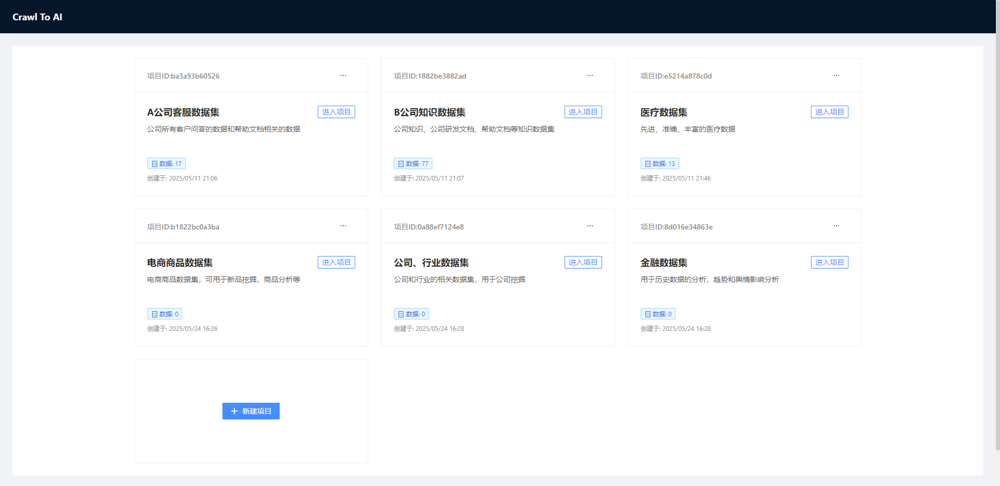
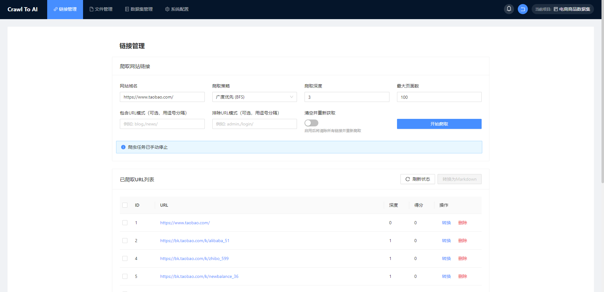
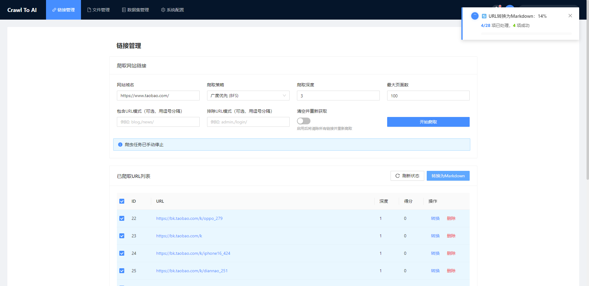
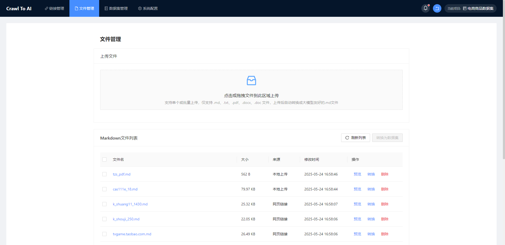
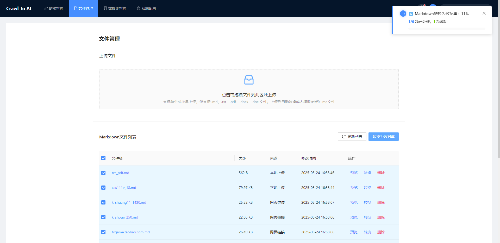
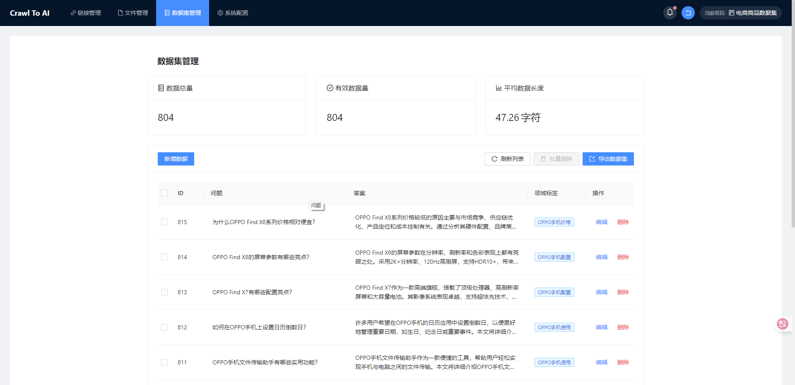
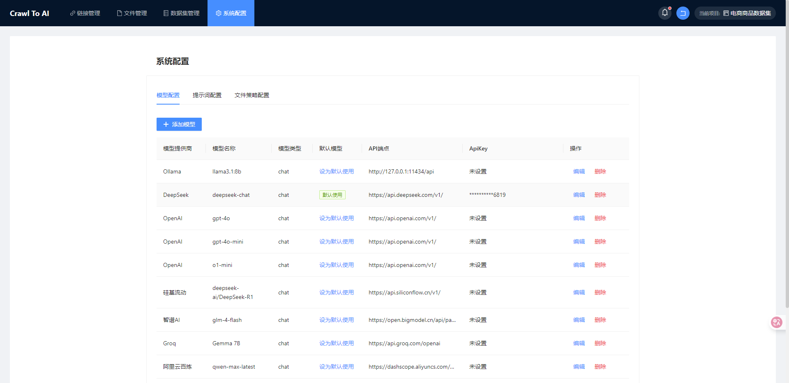

<div align="center">

**一个强大的大模型微调数据集生成和管理工具**

[简体中文](./README.md) | [English](./README.en.md)

</div>

# 数据集生成、大模型微调工具

大模型微调数据集生成和管理工具，一键爬取指定域名的链接，支持把链接转换成大模型友好的Markdown文件，支持将Markdown文件通过ChatGPT、Deepseek、Gemma等大模型转换成训练大模型可用的数据集。

## 功能特点

- 支持深度爬取指定域名的所有链接
- 支持将链接转换成大模型友好的Markdown文件
- 支持上传.md、.txt、.pdf、.docx、.doc等文件，自动转换成.md文件
- 支持智能算法对Markdown文件分段
- 支持通过DeepSeek、ChatGPT、Gemma等大模型将Markdown转换成训练大模型可用的数据集
- 支持数据集数据的自定义增加、编辑、修改
- 支持导出 JSONL 和 JSON 两种输出格式，Alpaca、ShareGPT 和自定义格式
- 支持预览转换结果

## 功能截图

<table>
  <tr>
    <td align="center" width="33%">
      
      <br><small>项目管理</small>
    </td>
    <td align="center" width="33%">
      
      <br><small>链接管理</small>
    </td>
    <td align="center" width="33%">
      
      <br><small>Md文件转换</small>
    </td>
  </tr>
  <tr>
    <td align="center" width="33%">
      
      <br><small>文件管理</small>
    </td>
    <td align="center" width="33%">
      
      <br><small>文件转换成数据集</small>
    </td>
    <td align="center" width="33%">
      
      <br><small>数据管理</small>
    </td>
  </tr>
  <tr>
    <td align="center" width="33%">
      
      <br><small>系统设置</small>
    </td>
    <td align="center" width="33%">
    </td>
    <td align="center" width="33%">
    </td>
  </tr>
</table>

## 快速开始

### 安装依赖

1. 后端依赖：

```bash
# 建议运行python的版本python=3.10
# 创建虚拟环境
python -m venv venv
# 激活环境（在PowerShell中）
.\venv\Scripts\Activate.ps1
# 从requirements.txt安装所有依赖
pip install -r requirements.txt
```

2. 前端依赖：

```bash
cd frontend
npm install
```

### 运行项目

1. 启动后端服务器：

```bash
uvicorn app.main:app --reload --host 0.0.0.0 --port 8000 --ws websockets
```

2. 启动前端开发服务器：

```bash
cd frontend
npm run dev
```

3. 在浏览器中访问：`http://localhost:3000`

## 项目结构

```
├── app/                    # 后端应用目录
│   ├── api/                # API接口目录
│   │   ├── crawler.py      # 爬虫API
│   │   ├── system.py       # 系统API
│   │   ├── files.py        # 文件操作API
│   │   ├── dataset.py      # 数据集API
│   │   └── __init__.py     # 初始化文件
│   ├── core/               # 核心功能
│   │   └── config.py       # 配置文件
│   ├── schemas/            # 数据模式
│   │   ├── crawler.py      # 爬虫模式
│   │   ├── system.py       # 系统模式
│   │   ├── files.py        # 文件模式
│   │   └── dataset.py      # 数据集模式
│   ├── services/           # 服务层
│   │   ├── crawler_service.py    # 爬虫服务
│   │   ├── system_service.py     # 系统服务
│   │   ├── files_service.py      # 文件服务
│   │   └── dataset_service.py    # 数据集服务
│   ├── utils/              # 工具函数
│   ├── __init__.py         # 初始化文件
│   └── main.py             # 主程序入口
├── frontend/               # 前端目录
│   ├── src/                # 源代码
│   │   ├── assets/         # 静态资源
│   │   ├── components/     # 组件目录
│   │   ├── services/       # 服务
│   │   │   ├── crawler.js  # 爬虫服务
│   │   │   └── request.js  # 请求服务
│   │   ├── views/          # 视图
│   │   │   ├── LinkManager.vue   # 链接管理页面
│   │   │   └── ...         # 其他视图页面
│   │   ├── App.vue         # 主应用组件
│   │   └── main.js         # 入口文件
│   ├── index.html          # HTML入口
│   ├── package.json        # 依赖配置
│   ├── vite.config.js      # Vite配置
│   ├── vue.config.js       # Vue配置
│   ├── .env                # 环境变量
│   ├── .env.production     # 生产环境变量
│   └── .prettierrc         # 代码格式配置
├── config/                 # 配置文件目录
├── export/                 # 导出目录
│   ├── alpaca/             # Alpaca格式导出
│   ├── sharegpt/           # ShareGPT格式导出
│   └── custom/             # 自定义格式导出
├── logs/                   # 日志目录
├── output/                 # 输出目录
│   ├── crawled_urls.json   # 爬取的URL列表(JSON格式)
│   ├── crawler_status.json # 爬虫状态信息
│   ├── markdown/           # 转换后的Markdown文件
│   └── markdown_manager.json # Markdown文件管理信息
├── upload/                 # 上传文件目录
├── .gitignore              # Git忽略文件配置
├── README.md               # 英文说明文档
├── README.zh-CN.md         # 中文说明文档
└── requirements.txt        # Python依赖文件
```

## 常见问题处理

1. 运行过程如果提示下面报错
No module named 'markitdown'
No module named 'onnxruntime'

可以尝试在全局安装
```bash
pip install 'markitdown[all]'
pip install onnxruntime
```

### 贡献

如果你有好的意见或建议，欢迎给我们提issue或pull request。

### License
The MIT License(http://opensource.org/licenses/MIT)